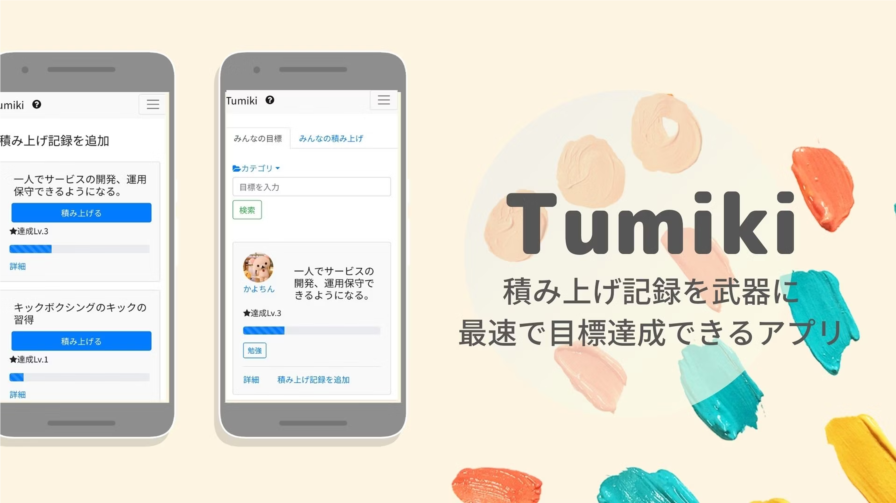
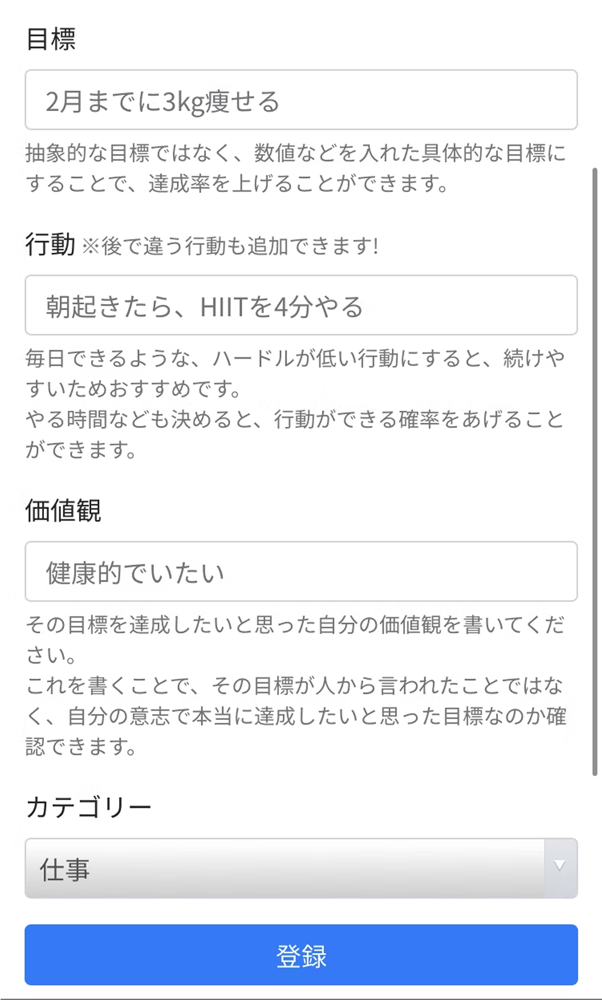
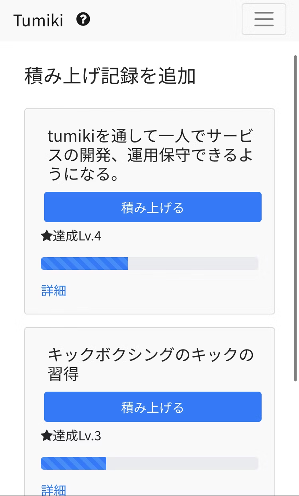
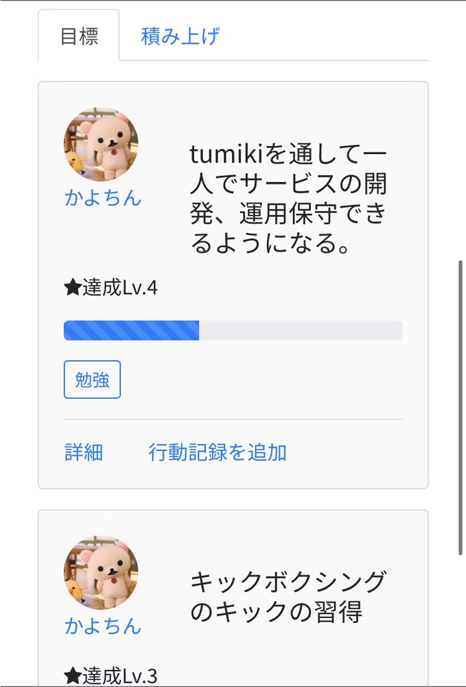
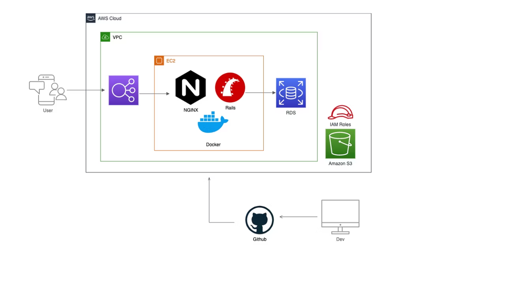

tumiki is a web application designed to help you set, track, and achieve your goals without giving up. By incorporating a proven framework and gamification elements, it keeps you motivated on your journey to success.

---

## ✨ Features

- **Goal Achievement Framework:** Uses the MAC framework (Measurable, Actionable, Competent) from an overseas university to increase goal achievement rates.
- **Motivating Rank-Up System:** Rank increases as you log progress, giving a sense of accomplishment even before reaching the final goal.
- **Community Inspiration:** View other users' goals and progress for motivation and idea generation.
- **Simple Goal & Progress Tracking:** Register goals, required actions, and your "why," then log progress with a single click.  

---

## 📸 Screenshots

| Goal Registration | Progress Tracking | Community Goals |
|------------------|-----------------|----------------|
|  |  |  |

---

## 🛠️ Technologies Used

- **Backend:** Ruby on Rails  
- **Frontend:** HTML, CSS (Bootstrap)  
- **Development Environment:** Docker  
- **Deployment:** AWS EC2, NGINX
